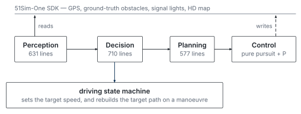

# Autonomous Vehicle Simulation — CUEPIAC 2023

A rule-based autonomous-driving stack written for the 51Sim-One simulation
platform used by CUEPIAC 2023. It reads simulated GPS, obstacle and traffic
signal data, queries the HD map for lanes and routes, runs an eight-state
driving state machine, and returns throttle, brake and steering through the
competition SDK. Awarded First Prize.

[](LICENSE)
[](#project-status)
[](#recognition)
[](#building)
[-orange.svg)](#requirements)

## Overview



*Four hand-written layers over simulator ground truth, driven by the driving state machine.*

This repository preserves the final implementation developed for the **China
Undergraduate Engineering Practice and Innovation Ability Competition
(CUEPIAC 2023)**, autonomous-driving simulation track.

The system is a single-threaded control loop. Every tick it pulls the vehicle
state and the obstacle list from the simulator, resolves the current lane and
the remaining route against the HD map, decides what driving behaviour applies,
generates a short target path, and tracks that path with a pure-pursuit
steering law and a PID speed controller.

It is a **classical, fully hand-written stack**. Behaviour is expressed as
explicit predicates over map geometry and obstacle geometry, and every decision
the car makes can be traced to a named function.

## Recognition

First Prize, CUEPIAC 2023.

## Repository layout

```text
.
├── Impl/                 # All first-party code
│   ├── app/autodrive.cpp #   main loop and driving state machine (~1.1k lines)
│   ├── perception/       #   obstacle, sign and traffic-light interpretation
│   ├── planning/         #   reference path, lane-change paths, Bézier smoothing
│   ├── decision/         #   lane-change legality, junction and stop-line logic
│   ├── control/          #   PID speed controller
│   ├── common/           #   shared types and the headers for the three layers
│   └── util/             #   math, string, sign-type and driver helpers
├── include/              # Third-party headers: 51Sim-One SDK and Eigen 3.2.3
├── WinLibs/              # Third-party Windows binaries shipped by the SDK
├── CMakeLists.txt
└── LICENSE
```

First-party code is roughly 3,900 lines across 20 files in `Impl/`. Everything
under `include/` and `WinLibs/` is third-party and keeps its own licence.

## Requirements

- Windows, and the official 51Sim-One simulation platform supplied by the
  competition organisers. The binary links against that SDK and cannot be run
  or meaningfully tested without it.
- CMake 3.26 or newer.
- A C++14 toolchain (MSVC was used).

The simulator itself is not distributed here and is not publicly available.

## Building

```bash
cmake -S . -B build
cmake --build build --config Release
```

The executable is written to `Release/` and the SDK DLLs are copied next to it
by a post-build step.

## Project Status

Archived. The competition submission as it stood at the end of CUEPIAC 2023,
with later comment cleanup.

## License

Copyright 2023 Yixuan Huang

First-party source code, design files and documentation in this repository are
licensed under the Apache License, Version 2.0 — see [LICENSE](LICENSE).

The competition SDK headers and binaries, the Eigen headers, the FFmpeg
binaries, and all other third-party material remain under their own licenses
and are **not** covered by this repository's license.

## Contact

- Website: [yixuanhuang.com](https://yixuanhuang.com)
- Email: [yixnhuang@gmail.com](mailto:yixnhuang@gmail.com)
